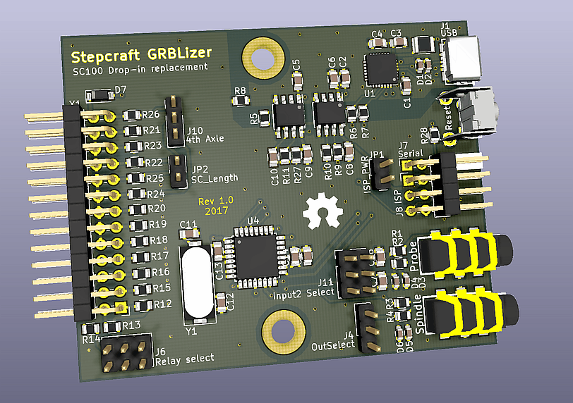

# Stepcraft GRBLizer

A GRBL compatible controller for use as a drop-in replacement for the SC100 USB standard controller deliverd with Stepcraft CNC machines. This Arduino Uno compatible controller is wired conforming the GRL v0.9+ standard. The controller can be used with the GRBL firmware and with EstlCAM. 

## Features
  - The PC is fully electrically isolated from the CNC machine (optional).
  - All inputs protected with clamping diodes and resistors.
  - Probe inputs have a 100 Ohm / 100nF low pass filter to suppress spurious triggering. (Filter values may be experimented with.)
  - 3.5mm Jack for spindle / laser / hot-end control
  - 3.5mm Jack input for 2 probes.
  - Serial interface fed out the back (TTL, not protected). For people in a hurry: CP2102 and isolator ICs can be left unpopulated.
  - Standard 6 pin ISP programming connector fed out the back  (not protected).
  - Some juper block for IO-config

Alvast een leuk plaatje:
